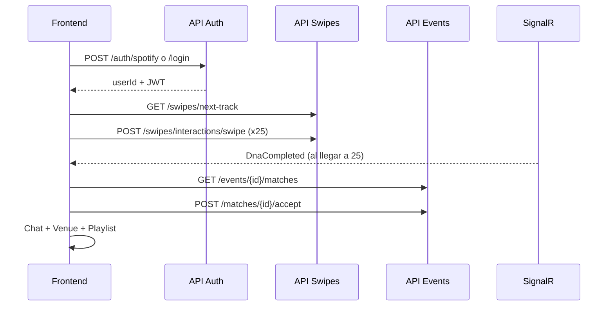

# Encorely API — Guía de integración para Frontend

Documentación para conectar la app cliente (web/móvil) con el backend Encorely. Todos los endpoints viven bajo el prefijo **`/api/v1`**.

---

## URLs base

| Entorno | Base URL | Swagger UI |
|--------|----------|------------|
| Producción (Render) | `https://encorly-back.onrender.com` | `https://encorly-back.onrender.com/docs` |
| Docker | `http://localhost:8080` | `http://localhost:8080/docs` |
| Local (`dotnet run`) | `http://localhost:5000` o `https://localhost:5001` | `http://localhost:5000/docs` |

En el resto del documento, `{BASE}` representa la URL base elegida.

---

## Convenciones generales

### Formato JSON

- **Request/Response**: `application/json`
- **Nombres de propiedades**: `camelCase` (ej. `accessToken`, `swipeCount`)
- **Fechas**: ISO 8601 UTC (`2026-05-22T14:30:00Z`)

### Enums (importante)

Los enums se serializan como **números enteros**, no como strings.

| Enum | Valores |
|------|---------|
| `AuthProvider` | `0` Spotify, `1` Google, `2` Custom |
| `ConcertMood` | `0` Moshpit, `1` Chill, `2` VIP |
| `SwipeDirection` | `0` Left (dislike), `1` Right (like), `2` Down (superlike) |

En respuestas de perfil, `provider` y `mood` llegan como **string** (`"Spotify"`, `"Chill"`, etc.) porque el backend usa `.ToString()`.

### Autenticación JWT (estado actual)

El backend **genera JWT** en login/registro, pero **ningún controlador exige `[Authorize]`** hoy. La identidad del usuario se pasa explícitamente con:

- Query: `?userId={guid}`
- Body: `{ "userId": "..." }`

**Recomendación para el front:**

1. Guardar `userId`, `accessToken` y `refreshToken` tras autenticarse.
2. Enviar `Authorization: Bearer {accessToken}` en todas las peticiones (preparado para cuando se active la validación JWT).
3. Usar siempre el `userId` devuelto por auth en query/body según indique cada endpoint.

Variables JWT del servidor (no las necesita el front, salvo para debug):

- `JWT_SECRET_KEY`, `JWT_ISSUER`, `JWT_AUDIENCE` (opcionales; hay defaults en código)

### CORS

No hay política CORS configurada en `Program.cs`. Si el front corre en otro origen (ej. `http://localhost:8081` con `expo start --web`), el navegador puede bloquear peticiones hasta que el backend habilite CORS.

**Opciones para desarrollo web (Expo):**

1. **Probar en iOS/Android** — no aplica CORS del navegador.
2. **Backend con CORS** — permitir el origen del dev server (`http://localhost:8081`, etc.).
3. **Proxy mismo origen** — servir el export web y reenviar `/api` al backend (p. ej. nginx o un proxy local). En `app.json` podés usar `extra.apiBaseUrl` relativo solo si el host que sirve el JS también proxea `/api/v1` hacia `https://encorly-back.onrender.com`.

El cliente HTTP usa `getApiBaseUrl()` desde `src/config/api.ts` (`extra.apiBaseUrl` en producción: Render).

### Errores

Errores no controlados → `500` con cuerpo:

```json
{
  "statusCode": 500,
  "message": "Internal Server Error"
}
```

En desarrollo, `message` puede incluir el detalle de la excepción y `stackTrace`.

Errores de negocio usan códigos HTTP explícitos (`400`, `403`, `404`) con `{ "message": "..." }`.

---

## Flujo recomendado para el front



1. **Autenticar** → obtener `userId`.
2. **Swipes** → al menos **25** para desbloquear Radar y chat (regla “Umbral”).
3. **Escuchar** `DnaCompleted` en `/notificationHub` (opcional, cuando el worker procese el hito).
4. **Feed de eventos** → elegir evento → **Radar** de compatibles.
5. **Aceptar match** → abrir chat con `roomId` (= `matchId`).
6. **Venue** / **DNA playlist** según pantalla.

---

## Autenticación — `/api/v1/auth`

Controlador: `AuthController`. Rutas en minúsculas en la práctica (`/api/v1/auth/...`).

### POST `/api/v1/auth/spotify`

Intercambia el **access token de Spotify** (obtenido en el OAuth del cliente) por sesión Encorely.

**Body:**

```json
{
  "token": "BQC...access_token_de_spotify"
}
```

| Campo | Tipo | Requerido | Descripción |
|-------|------|-----------|-------------|
| `token` | string | sí | Access Token de Spotify del usuario |

**Respuesta:** `202 Accepted`

```json
{
  "accessToken": "eyJhbGciOiJIUzI1NiIs...",
  "refreshToken": "base64...",
  "expiration": "2026-05-22T15:00:00Z",
  "userId": "3fa85f64-5717-4562-b3fc-2c963f66afa6"
}
```

**Efecto en backend:** crea usuario si no existe, genera perfil musical desde Spotify, publica evento Kafka `UserDnaSync`.

---

### POST `/api/v1/auth/google`

**Body:** igual que Spotify (`{ "token": "..." }`).

**Respuesta:** `202 Accepted` — mismo shape que Spotify.

**Nota:** la validación de Google ID token es **mock** (genera usuario ficticio). Útil para desarrollo.

---

### POST `/api/v1/auth/register`

Registro email/contraseña.

**Body:**

```json
{
  "email": "user@example.com",
  "password": "miPasswordSegura"
}
```

**Respuesta:** `202 Accepted` — `TokenResponse` igual que arriba.

**Error:** email ya registrado → `500` (excepción no tipada).

---

### POST `/api/v1/auth/login`

**Body:** mismo que register.

**Respuesta:** `200 OK` — `TokenResponse`.

**Error:** credenciales inválidas → `500`.

---

### Ejemplo (fetch)

```javascript
const res = await fetch(`${BASE}/api/v1/auth/spotify`, {
  method: 'POST',
  headers: { 'Content-Type': 'application/json' },
  body: JSON.stringify({ token: spotifyAccessToken }),
});
const session = await res.json();
// session.userId, session.accessToken
localStorage.setItem('encorely_user_id', session.userId);
localStorage.setItem('encorely_token', session.accessToken);
```

---

## Usuario — `/api/v1/user`

### GET `/api/v1/user/me?userId={guid}`

Perfil y progreso del Umbral.

**Query:**

| Parámetro | Tipo | Requerido |
|-----------|------|-----------|
| `userId` | GUID | sí |

**Respuesta:** `200 OK`

```json
{
  "id": "3fa85f64-5717-4562-b3fc-2c963f66afa6",
  "displayName": "Ana",
  "email": "ana@example.com",
  "provider": "Spotify",
  "swipeCount": 12,
  "mood": "Chill"
}
```

**404** si el usuario no existe.

---

### PUT `/api/v1/user/settings`

Actualiza el mood del concierto (filtro del Radar).

**Body:**

```json
{
  "userId": "3fa85f64-5717-4562-b3fc-2c963f66afa6",
  "mood": 0
}
```

| Campo | Tipo | Valores `mood` |
|-------|------|----------------|
| `userId` | GUID | — |
| `mood` | int | `0` Moshpit, `1` Chill, `2` VIP |

**Respuesta:** `204 No Content`

**404** si `userId` no existe.

---

## Swipes — `/api/v1/swipes`

### GET `/api/v1/swipes/next-track?userId={guid}`

Devuelve la siguiente pista para la UI de swipe.

**Respuesta:** `200 OK`

Usuario **no Spotify** (Musical Bridge):

```json
{
  "spotifyId": "pop_track_456",
  "name": "Popular Hit",
  "artist": "Encorely Artist",
  "previewUrl": "https://p.scdn.co/mp3-preview/bridge"
}
```

Usuario **Spotify**:

```json
{
  "spotifyId": "5upAn8J6pXW4G4lWf3P4",
  "name": "Vampire Empire",
  "artist": "Big Thief",
  "previewUrl": "https://p.scdn.co/mp3-preview/direct"
}
```

*(Hoy son datos mock; el contrato es estable para el front.)*

---

### POST `/api/v1/swipes/interactions/swipe`

Registra un swipe e incrementa `swipeCount`. Dispara evento Kafka `swipe-raw-events`.

**Body:**

```json
{
  "userId": "3fa85f64-5717-4562-b3fc-2c963f66afa6",
  "trackId": "5upAn8J6pXW4G4lWf3P4",
  "direction": 1
}
```

| Campo | Tipo | Descripción |
|-------|------|-------------|
| `userId` | GUID | Usuario autenticado |
| `trackId` | string | ID de track Spotify |
| `direction` | int | `0` Left, `1` Right, `2` Down |

**Respuesta:** `202 Accepted` (sin cuerpo)

**Errores:** usuario inexistente → `500`.

---

## Eventos y Radar — `/api/v1/events`

### GET `/api/v1/events/feed`

Listado de eventos cercanos (mock Ticketmaster).

**Respuesta:** `200 OK` — array:

```json
[
  {
    "id": "TM_001",
    "name": "Lollapalooza 2026",
    "venue": "Grant Park, Chicago",
    "date": "2026-08-01",
    "mood": "Moshpit",
    "affiliatePurchaseUrl": "https://www.ticketmaster.com/..."
  }
]
```

`eventId` para el radar es el campo `id` (string, ej. `"TM_001"`).

---

### GET `/api/v1/events/{eventId}/matches?userId={guid}&targetMood={int?}`

**Radar de compatibilidad** para un evento. El `eventId` en la ruta no filtra candidatos hoy; se usa para contexto de UI.

**Query:**

| Parámetro | Tipo | Requerido | Descripción |
|-----------|------|-----------|-------------|
| `userId` | GUID | sí | Usuario actual |
| `targetMood` | int | no | `0/1/2`; si omites, usa el `mood` del usuario |

**Reglas:**

- `swipeCount < 25` → **`403 Forbidden`**
  ```json
  { "message": "Debes completar el Umbral de los 25 swipes" }
  ```
- Sin perfil musical → **`400 Bad Request`**
  ```json
  { "message": "Musical profile not found for user." }
  ```
- Usuario no encontrado → **`404`**

**Respuesta:** `200 OK` — array ordenado por afinidad descendente:

```json
[
  {
    "id": "7c9e6679-7425-40de-944b-e07fc1f90ae7",
    "displayName": "Carlos",
    "affinity": 0.82,
    "isHighPriority": false,
    "mood": "Moshpit"
  }
]
```

| Campo | Significado |
|-------|-------------|
| `affinity` | Similitud coseno **0.0–1.0** (no porcentaje 0–100). Umbral de match: **≥ 0.70** |
| `isHighPriority` | En código se compara con `85.0` (bug conocido); con afinidad 0–1 suele ser `false`. Tratar como hint UI opcional |
| `mood` | Mood del candidato (string) |

---

## Matches — `/api/v1/matches`

### GET `/api/v1/matches/pending?userId={guid}`

Matches donde participa el usuario (pendientes / histórico simplificado).

**Respuesta:** `200 OK`

```json
[
  {
    "matchId": "3fa85f64-5717-4562-b3fc-2c963f66afa6",
    "displayName": "Match 3fa8",
    "compatibility": 0.75
  }
]
```

---

### POST `/api/v1/matches/{matchId}/accept?userId={guid}`

Acepta un match, crea mensaje de bienvenida y notifica por SignalR + push.

**Respuesta:** `200 OK`

```json
{
  "roomId": "3fa85f64-5717-4562-b3fc-2c963f66afa6"
}
```

`roomId` es igual al `matchId` (GUID del match).

**Errores:** match no encontrado → `500`.

---

## Chat (1 a 1) — `/api/v1/chat`

### GET `/api/v1/chat/{roomId}/messages?userId={guid}`

Historial del match. `roomId` = `matchId`.

**Regla extra:** usuarios **Google** con `swipeCount < 25` → **`400`**

```json
{ "message": "Su ADN musical aún no es suficiente para chatear" }
```

**Respuesta:** `200 OK`

```json
[
  {
    "senderId": "00000000-0000-0000-0000-000000000000",
    "content": "¡Match creado! Ya pueden chatear.",
    "timestamp": "2026-05-22T12:00:00Z"
  },
  {
    "senderId": "3fa85f64-5717-4562-b3fc-2c963f66afa6",
    "content": "Hola!",
    "timestamp": "2026-05-22T12:01:00Z"
  }
]
```

`senderId` `00000000-0000-0000-0000-000000000000` = mensaje del sistema.

---

### POST `/api/v1/chat/{matchId}/messages?userId={guid}`

**Body:** string JSON (no un objeto). Content-Type `application/json`.

```json
"Hola, ¿vamos al concierto?"
```

**Respuesta:** `200 OK`

```json
{
  "id": "8b2e...",
  "content": "Hola, ¿vamos al concierto?",
  "timestamp": "2026-05-22T12:05:00Z"
}
```

**400** si el contenido está vacío.

**Ejemplo axios:**

```javascript
await axios.post(
  `${BASE}/api/v1/chat/${matchId}/messages`,
  JSON.stringify('Hola!'), // body = string JSON
  {
    params: { userId },
    headers: { 'Content-Type': 'application/json' },
  }
);
```

---

## Venue (salas grupales en vivo) — `/api/v1/venue`

### POST `/api/v1/venue/{eventId}/rooms?name={string}&durationHours={int}`

Crea sala temporal para un evento.

**Query:**

| Parámetro | Default | Descripción |
|-----------|---------|-------------|
| `name` | — | Nombre de la sala (ej. `"Moshpit"`) |
| `durationHours` | `4` | Horas hasta `expiresAt` |

**Respuesta:** `200 OK`

```json
{
  "id": "room-guid",
  "name": "Moshpit",
  "expiresAt": "2026-05-22T20:00:00Z",
  "eventId": "TM_001"
}
```

---

### GET `/api/v1/venue/{roomId}/messages`

Mensajes **no moderados** de la sala.

**Respuesta:** `200 OK` — array de `VenueMessage`:

```json
[
  {
    "id": "...",
    "roomId": "...",
    "senderId": "...",
    "content": "¡Qué buen set!",
    "isModerated": false,
    "timestamp": "2026-05-22T18:00:00Z"
  }
]
```

---

### POST `/api/v1/venue/{roomId}/messages?userId={guid}`

**Body:** string JSON (igual que chat).

Moderación automática por palabras: `spam`, `odio`, `hate`, `violencia`, `violence`, `scam`.

**Respuesta:** `200 OK`

```json
{
  "id": "...",
  "content": "texto",
  "isModerated": false,
  "timestamp": "2026-05-22T18:01:00Z"
}
```

Si `isModerated: true`, el mensaje **no** se reenvía por SignalR al grupo.

Sala expirada → `500`.

---

### DELETE `/api/v1/venue/messages/{messageId}?reason={string}`

Moderación manual (admin).

**Query:** `reason` (opcional, default `"Moderación manual"`).

**Respuesta:** `200 OK` o `404`.

---

## Playlist DNA — `/api/v1/playlist`

### POST `/api/v1/playlist/dna-mix?userId1={guid}&userId2={guid}&accessToken1={string}&accessToken2={string}`

Crea playlist colaborativa en Spotify mezclando top tracks de ambos usuarios.

**Query:** los cuatro parámetros son **requeridos**. `accessToken1/2` son access tokens de Spotify de cada usuario.

**Respuesta:** `200 OK`

```json
{
  "spotifyPlaylistId": "37i9dQZF1DX...",
  "name": "Encorely DNA Mix 🎵",
  "description": "Mezcla musical generada por afinidad...",
  "totalTracks": 20,
  "externalUrl": "https://open.spotify.com/playlist/...",
  "syncSuccess": true
}
```

---

## SignalR (tiempo real)

Conectar con `@microsoft/signalr` (o equivalente).

| Hub | URL |
|-----|-----|
| Notificaciones | `{BASE}/notificationHub` |
| Venue | `{BASE}/venueHub` |

### Hub `notificationHub`

**Unirse al grupo del usuario** (obligatorio para recibir eventos):

```javascript
await connection.invoke('JoinUserGroup', userId); // string GUID
```

**Eventos que emite el servidor:**

| Evento | Cuándo | Payload |
|--------|--------|---------|
| `DnaCompleted` | Worker detecta swipe #25 | `{ userId, message }` |
| `NotifyMatchFound` | Al aceptar match | `(userId, matchId, affinityScore)` — tres argumentos sueltos, no un objeto |

Ejemplo listener:

```javascript
connection.on('DnaCompleted', (payload) => {
  console.log(payload.userId, payload.message);
});

connection.on('NotifyMatchFound', (userId, matchId, affinity) => {
  // affinity: número (score del match)
});
```

### Hub `venueHub`

```javascript
await connection.invoke('JoinVenueRoom', roomId);   // string
await connection.invoke('LeaveVenueRoom', roomId);
await connection.invoke('SendVenueMessage', roomId, userId, message);
```

**Eventos:**

| Evento | Payload |
|--------|---------|
| `ReceiveVenueMessage` | `(userId, message, timestamp)` |
| `UserJoined` / `UserLeft` | `connectionId` |

También el API REST `POST .../venue/{roomId}/messages` emite `ReceiveVenueMessage` al grupo `venue_{roomId}` si el mensaje no fue moderado.

---

## Resumen de endpoints

| Método | Ruta | Auth / IDs | Descripción |
|--------|------|------------|-------------|
| POST | `/api/v1/auth/spotify` | Body `token` | Login Spotify |
| POST | `/api/v1/auth/google` | Body `token` | Login Google (mock) |
| POST | `/api/v1/auth/register` | Body email/password | Registro |
| POST | `/api/v1/auth/login` | Body email/password | Login email |
| GET | `/api/v1/user/me` | Query `userId` | Perfil + swipeCount |
| PUT | `/api/v1/user/settings` | Body userId + mood | Cambiar mood |
| GET | `/api/v1/swipes/next-track` | Query `userId` | Siguiente track |
| POST | `/api/v1/swipes/interactions/swipe` | Body userId, trackId, direction | Registrar swipe |
| GET | `/api/v1/events/feed` | — | Feed eventos |
| GET | `/api/v1/events/{eventId}/matches` | Query userId, targetMood? | Radar (≥25 swipes) |
| GET | `/api/v1/matches/pending` | Query `userId` | Lista matches |
| POST | `/api/v1/matches/{matchId}/accept` | Query `userId` | Aceptar match |
| GET | `/api/v1/chat/{roomId}/messages` | Query `userId` | Mensajes chat |
| POST | `/api/v1/chat/{matchId}/messages` | Query `userId`, body string | Enviar mensaje |
| POST | `/api/v1/venue/{eventId}/rooms` | Query name, durationHours? | Crear sala |
| GET | `/api/v1/venue/{roomId}/messages` | — | Mensajes venue |
| POST | `/api/v1/venue/{roomId}/messages` | Query `userId`, body string | Publicar en venue |
| DELETE | `/api/v1/venue/messages/{messageId}` | Query reason? | Moderar mensaje |
| POST | `/api/v1/playlist/dna-mix` | Query userId1/2, accessToken1/2 | Playlist Spotify |

---

## Reglas de negocio (para UX)

| Regla | Detalle |
|-------|---------|
| **Umbral 25 swipes** | Radar (`/events/.../matches`) bloqueado hasta `swipeCount >= 25` |
| **Compatibilidad** | Solo aparecen usuarios con `affinity >= 0.70` |
| **Chat Google** | Usuarios provider Google necesitan 25 swipes para leer chat |
| **Afinidad** | Valor entre 0 y 1; mostrar en UI como `%` multiplicando × 100 si quieres |
| **Mood** | Filtra candidatos por `ConcertMood`; mismo enum en settings y radar |
| **Venue** | Salas expiran; mensajes con keywords se marcan `isModerated: true` |

---

## Cliente HTTP sugerido

```typescript
const API = import.meta.env.VITE_API_URL ?? 'http://localhost:5000';

export async function api<T>(
  path: string,
  options: RequestInit & { userId?: string } = {}
): Promise<T> {
  const { userId, ...init } = options;
  const url = new URL(`${API}${path}`);
  if (userId) url.searchParams.set('userId', userId);

  const token = localStorage.getItem('encorely_token');
  const headers: HeadersInit = {
    'Content-Type': 'application/json',
    ...(init.headers as Record<string, string>),
  };
  if (token) headers['Authorization'] = `Bearer ${token}`;

  const res = await fetch(url, { ...init, headers });
  if (!res.ok) {
    const err = await res.json().catch(() => ({}));
    throw new Error(err.message ?? res.statusText);
  }
  if (res.status === 204) return undefined as T;
  return res.json();
}

// Uso
const me = await api<{ swipeCount: number }>(`/api/v1/user/me`, { userId });
```

---

## Infra local (referencia)

```bash
docker compose up -d   # Postgres + Kafka
dotnet run --project EncorelyApi
# Opcional: worker para DnaCompleted
dotnet run --project EncorelyWorker
```

Variables en `.env` (backend): `DB_*`, `KAFKA_*`, `GET_SPOTIFY_CLIENT_ID`, `GET_SPOTIFY_CLIENT_SECRET`, etc. El front solo necesita el **Client ID de Spotify** para OAuth; los secretos van en el servidor.

---

## Frontend — estructura de capas (cliente)

El repo Expo organiza la integración con esta API así:

```text
src/
├── config/api.ts              # apiBaseUrl, API_PREFIX, getApiUrl()
├── clients/
│   ├── http/client.ts         # fetch genérico + Bearer + userId query
│   └── encorely/
│       ├── types/             # DTOs (TokenResponse, NextTrack, …)
│       ├── *Client.ts         # una función por endpoint REST
│       └── lib/session.ts     # userId + JWT en secure storage
└── modules/<feature>/
    ├── screens/
    ├── hooks/                 # consume services (futuro)
    ├── services/              # orquestación → clients/encorely
    ├── types/                 # view models del módulo
    ├── context/ | lib/ | utils/
    └── components/
```

**Flujo:** `screen → hook → module/services → clients/encorely → http/client → API`

- Configuración de URL: `app.json` → `extra.apiBaseUrl` (prod: `https://encorly-back.onrender.com`).
- Spotify OAuth sigue en `clients/spotify/`; tras obtener el access token de Spotify, el siguiente paso es `POST /api/v1/auth/spotify` vía `authService`.
- Pantallas conectadas vía hooks en `modules/*/hooks` (auth, swipes, home, settings, radar, matches, chat).
- SignalR: `src/clients/encorely/signalrConnection.ts` + `useEncorelyNotifications` (hub `notificationHub`).

### Smoke test manual (integración UI)

1. `pnpm start` (o `pnpm web`) contra `extra.apiBaseUrl` → `https://encorly-back.onrender.com`.
2. OAuth Spotify → verificar sesión Encorely (`userId` en secure storage).
3. Swipe ≥ 25 tracks → `GET /user/me` refleja `swipeCount`.
4. Abrir Radar → feed de eventos → candidatos con afinidad (%).
5. Matches pendientes → aceptar → chat con `roomId`.
6. Ajustes → cambiar mood (Moshpit / Chill / VIP) → `PUT /user/settings`.
7. `pnpm exec tsc --noEmit` sin errores de tipos.

---

## Documentación relacionada

- Swagger interactivo: `{BASE}/docs`
- Resumen corto previo: `endpoints.md`
- PDF de proyecto: `Encorely_Documentacion_Proyecto_APA.pdf`

*Generado desde el código fuente de `EncorelyApi` — mantener sincronizado si cambian controladores o DTOs.*
